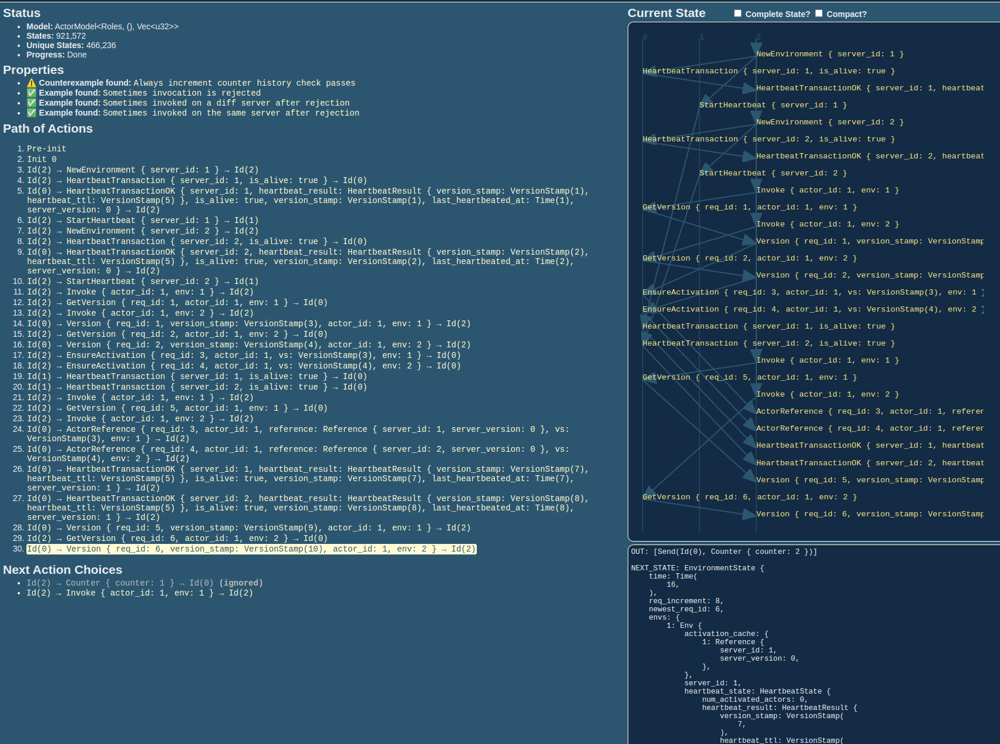

## Purpose of the model

The model was created to verify that only one instance of the same actor can be active at the same time after activation cache (to avoid a database transaction upon every actor invocation) has been introduced to NOLA.
The activation cache has been intoduced in this [PR](https://github.com/richardartoul/nola/pull/3) that implemented the following logic:

Client:
```
readVersion = fdb.getReadVersion() <-- batch/cache these
server = cache.getActivation()
routeRPC(server, readVersion)
```

Server:
```
backgroundLoop:
    latestHeartbeatVersionStamp, heartbeatTTL = fdb.heartbeat()
server RPC handler:
    if req.versionStamp > lastHeartbeatVersionStamp + heartbeatTLL:
        reject()
```

The heartbeat version stamp check should ensure that an invocation on a server that missed a heartbeat is rejected, which should in turn ensure that only one instance of an actor can run at a time.

## Findings

During formal verification the following state path was discovered that demostarted violation of the primary correctness property:



- env1 failed to heartbeat the registry and loses ownership of the actor
- actor is activated on env2
- env1 succeeds to heartbeat after a delay
- env1 receives a request to invoke the actor and proceeds with invocation

This caused two instances of one actor to be activated in two different environments.

This anomaly was addressed by adding the following logic:

- during a heartbeat transaction, `if last_heartbeated_at + ttl < now`, the server version is increased (this signifies that a heartbeat came in after the previous on has expired, which means there was a time where the server was considered dead)
- during the invocation request, the invocation if rejected `if env.server_version != reference.server_version` 

After the server version check was introduced, the correctness property of the model was satisfied.


## Running the model

Run:

```bash
cargo run --release explore
```

To explore the state space, go to [localhost:3000](http://localhost:3000/).

To observe the behavior of the model in the presence of violations before the server version comparison was introduced, comment out the server version check during actor invocation. (Search for `TRY IT` in the model code)

More information on Stateright can be found [here](https://github.com/stateright/stateright).